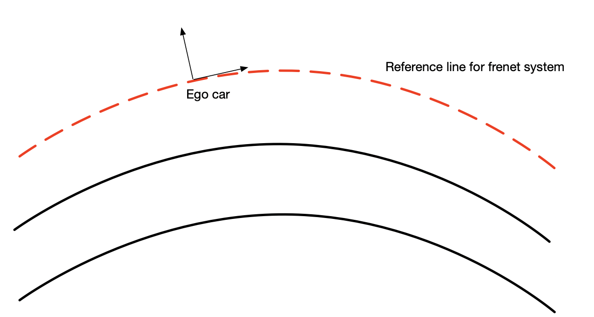

## Context

In autonomous driving, the Frenet coordinate system is often used. In the Frenet system, the coordinate of an object is defined by two values: the longitudinal and the lateral position of the object with respect to a reference line.

In this problem, the reference is given as a finite list of points. The task is to create a small C++ class that:
1. Constructs a continuous reference line given an input list of points in a cartersian coordinate C1.
2. Provides functionality to convert any point in the cartesian coordinate C1 (that is, in the same coordinate with the list of points used to construct the continuous reference line) to the frenet coordinate. Following the direction of the given input points, the first point on the input list has the longitudinal position of 0. All points on the reference line have the lateral position of 0. All points to the left of the reference line have negative lateral position and all points to the right have the positive lateral position.

Please write some unit-tests to demonstrate how to use your class. You can use any third-party library, but if that is the case, please explain how the third-party library works.

Sample input points are given as a protobuf message in text format, which can be found on this repository.

An illustration can be found in the image below. The red line is the reference line.

Instructions to compile the project:
g++ -o program-out test1.cpp -std=C++11 -lboost_iostreams -lboost_system -lboost_filesystem
